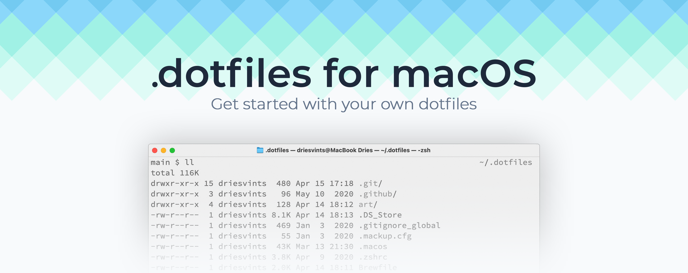

## Introduction

This repository serves as my way to help me setup and maintain my Mac. It takes the effort out of installing everything
manually. Everything needed to install my preferred setup of macOS is detailed in this readme. Feel free to explore,
learn and copy parts for your own dotfiles. Enjoy!

MacOS package manager `brew`

- Install
  - `/bin/bash -c "$(curl -fsSL https://raw.githubusercontent.com/Homebrew/install/HEAD/install.sh)"`
- Packages
  - `brew install iterm2` <!-- terminal emulator -->
  - `brew install git` <!-- version control system -->
  - `brew install stow` <!-- symlink farm manager -->
  - `brew install neovim` <!-- text editor -->
  - `brew install zsh` <!-- after installing z shell manualy instal zap plugin manager -->
  - `brew install tmux` <!-- terminal multiplexer -->
  - `brew install eza` <!-- Maintained modern replacement for 'ls' -->
  - `brew install fzf` <!-- fuzzy finder -->
  - `brew install tpm` <!-- after installing tmux plugin manager execute `< prefix > + shift+I` to install plugins -->
  - `brew install lazygit` <!-- simple terminal UI for git commands -->
  - `brew install bash bc coreutils gawk gsed` <!-- GNU utilities -->
- Packages which not available in brew
  - zap - zsh plugin manager
    - `zsh <(curl -s https://raw.githubusercontent.com/zap-zsh/zap/master/install.zsh) --branch release-v1`

Setup dotfiles

- install `brew` package manager
- install git `brew install git`
- clone dotfiles repository `git clone https://github.com/MBagrat/dotfiles ~/.dotfiles/` to `~/.dotfiles` directory
- move dotfiles to `~/dotfiles/stow` directory
- `stow -t ~ *` to symlink all dotfiles to home directory
- `brew bundle -g` to install all packages from Brewfile
